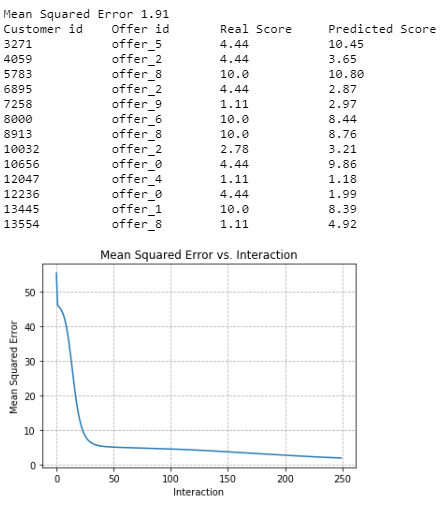

# Starbucks' recommendation engine: creating from the scrath.

## Motivation
Deepen my knowledge in machine learning.

## Overview

This project aims to create a recommendation engine using machine learning concepts. It will be based on FunkSVD to predict how well some customer will respond to a particular offersent to him by the Starbucks' mobile app.

## Main Result

To validate the FunkSVD model I've used Mean Squared Error metric and the comparison between train and testing data set. 
Thefore, the results of the best training are below.

## Files 

**Jupyter notebook**  
`starbucks.ipynb` 

**Data Sets**
`profile.json` 
`portfolio.json`
`transcript.json`

## Python Libraries

import pandas as pd
import numpy as np
import math
import json
import random
import matplotlib.pyplot as plt
from datetime import date, datetime

## Acknowledgment

* Machine Learning
* Data Engineering
* Python

  

  
	