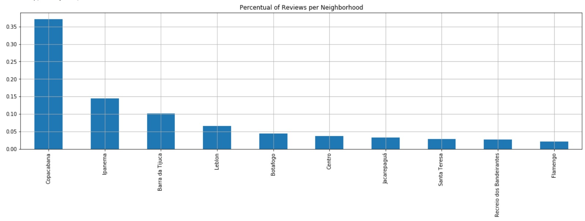

# **It will make you understand better the participation of Airbnb in the tourism market of Rio de Janeiro**

Brazil is a country of continental proportion that give you a lot of reasons to visit it. On of them is Rio de Janeiro, residence of Christ the Redeemer, this city is full of intresting attractions that anyone can enjoy. There are so many options that you could expend more than a month to explore all the touriscs points of this capital.  

For example, in the same day you can wake up early morning to hike in an amazing forest trail, try the local food in great restaurant at lunch time, enjoy copacabana beach in the afternoon and clubbing at night. It was just an example, the possibilities have the same size of your imagination. As if that were not enough, this city get much more exciting in New year's eve, Carnival and Rock in Rio.

No wonder Rio de Janeiro is one of the most sought Brazilians city in tourism industry worldwide. In 2019, this metropoly received 6.5 millions of visitors that has movimented a billions of dollar and made the local tourism industry grown 1,4% according Agência Brasil EBC [1]. 

Given this scenario, Airbnb is standing out for explored the Rio's tourism market very well and getting a solid position even facing proeminent competitors. Thus, I'll present to you how Airbnb is positioned in terms of average prices and number of reviews given by the guests. To reach that goal, I response the following question using public information available in the Airbnb website[2]. 
 
***(a) How fast is Airbnb growing in Rio de Janeiro?***    
***(b) How events affect Airbnb activities?***    
***(c) What are the most popular neighborhoods are the most wanted porperty types?***       
***(d) What are the average price per person in the most popular neighborhoods and property types?***  

Before I start my analysis, it's important expose my premises and reasons to use them.   

* First of all, Airbnb does not publish when an accomodations were rented or how long it has been rented. Without this data, calculate the number of bookings can be a difficult and inaccurate process. Thus, rather use numbers of bookings I prefered use number of reviews given by the guests because this two metrics are directly correlated.  

### **(a) How Airbnb is growing in Rio de Janeiro?** 

To view better how the Airbnb expantion occurs over the years, I've ploted the chart below. Which one represents the evolution of total numbers through the weeks.  

The rise of the cumulative number of reviews per week resembles a linear trend, indicating a constant growth rate during each year since 2015. Another great information obtained from the chart is that the slope is increasing by the year, which can be a strong sign of bookings growth. Lastly, the year 2020 was following the analysis made before till the eleventh week: 2 weeks after the first case confirmed of Covid-19 in Brazil. After that, the reviews decreases drastically to almost zero in the sixteenth week.

### ***(b) How events can boost Airbnb activities?***   

To study how some events can affect the Airbnb activities in Rio de Janeiro, I´ve preferred plotting a chart showing the number of reviews by week instead of the cumulative number of reviews as made in the previous graph.

Immediately, we can see prominent peaks in the chart above that represents a substantial elevation of reviews per week due to events. Some of them are clustered and others isolated. 
The clustered peaks can appear annually as New Year's Eve (1st week) and Carnival (between 6th and 9th week) or with some frequency as Rock in Rio that happened in 2016 (38th-39th week) and 2019 (40th week). In contrast, peaks of Olympics Games in 2016 (33rd week) and America Cup of football (25-28th week) show up alone.  Other peaks less expressive are related to a bank holiday or weekends and will be out of my analysis. Besides the peaks, a valley starts to turn up after the 11th week of 2020. As I've already said, it's a consequence of COVID-19, but in this chart, we can see more clearly how this disease knocked out Airbnb's activities.
To gauge what was the most and least impactful event, I've compared each peak to the average of the respective year in percentual terms. The results were compiled in the table below where we can see that Olympics Games were the most impactful with 355,94% and the least impactful was the America Cup of Football, which reached 22,90%. 

## **(c) What are the most popular neighborhood and the most wanted porperty type??**

The chart below show the top 10 neighborhoods that got the most reviews in 2019.

We can notice that 44% of the given reviews in 2019 were to accommodations located in Copacabana, followed by Ipanema, Barra da Tijuca and Leblon.  
    
Using the same criteria as for neighborhoods analysis, the most wanted property type was Apartament with aproximately 80,7% of reviews, followed by Serviced Apartament, Condominium, Loft and House.

***(d) What are the average price per person in the most popular neighborhoods and property types?***

Using the 10 most popular neighborhoods and 5 most required property types, it is possible to see that the both neighborhood and property type influence the avarege price per accommodate. Let's compare the different proprieties prices in Flamengo and Leblon neighborhoods: a house in Flamengo is much cheaper than in Leblon, but a Serviced apartament is more expensive in Flamengo. Is this chart, we can see that Leblon is the neighborhood which present the most expensive average price divided by property type.

#Contents 

* https://agenciabrasil.ebc.com.br/geral/noticia/2020-03/faturamento-de-operadoras-de-turismo-cresceu-14-em-2019 [1]
* http://insideairbnb.com/get-the-data.html [2]

Feel free to explore my project in my github: https://github.com/MarceloArrais/udacity-datascientist-nanodegree/tree/master/rio-de-janeiro-airbnb
