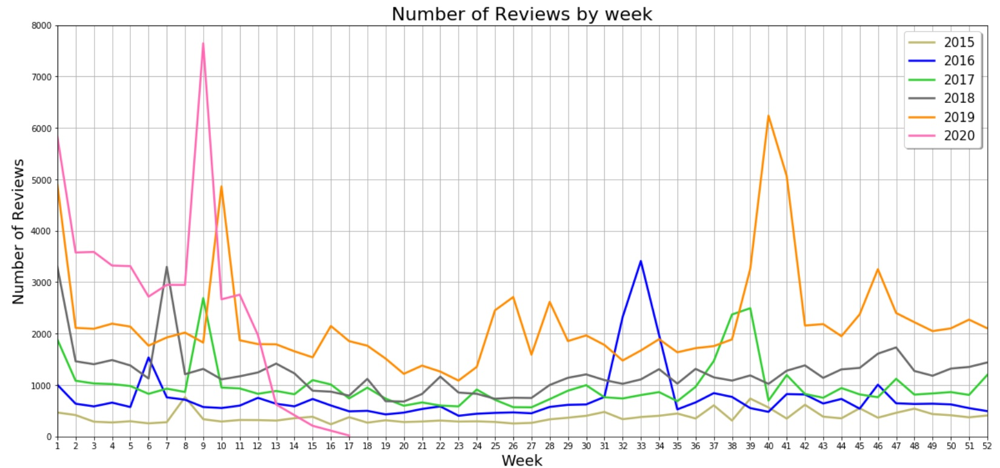
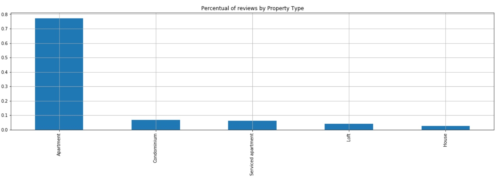
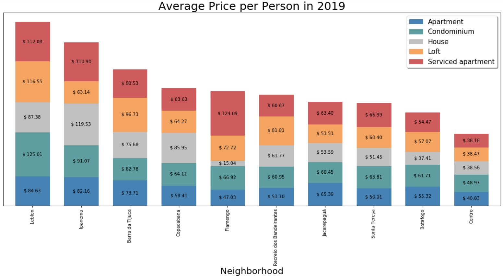

# 4 intriguing facts about Airbnb in Rio de Janeiro

The business model of Airbnb is earning  a solid position in strategic markets worldwide. One of them is Rio de Janeiro: the most recognizable Brazilian city abroad.  
In 2019, Rio received around 6.5 million visitors, the tourism industry has grown 1,4% and the market was evaluated in the billions of dollars, according to Agência Brasil EBC [1]. This is a promising market for a disruptive player as Airbnb.  
Thereby, in the light of tourism market in Rio, I explored the case study of Airbnb by using Data Science techniques. All data used in this article is publicly available at Inside Airbnb. [2]  
### This article will show you the following topics:  
1. Is Airbnb growing in Rio de Janeiro?  
2. How events as New Year’s Eve and Carnival affect Airbnb’s activities?  
3. The most popular neighbourhoods?  
4. Do the average price depend on both neighborhood and property type?  

### Airbnb growth
The chart below gives a visualization on how Airbnb is growing each year by counting the accumulative number of reviews in the platform.

It is visible the slope has increased and became notably steep every following year. That shows the increase in adoption of Airbnb in Rio de Janeiro, i.e., more and more people are using the platform.  
However, its worth to mention that in 2020 we can see a negative impact on the growth due to COVID-19, from the 11th week, two weeks after Brazil has confirmed the first case.

### Carnival, Olympic Games and New Year's Eve  
Traditional events like Carnival or even worldwide events like Olympic Games have a clear impact in Airbnb activity during these high demand weeks, as shown in the chart below.

We have clustered peaks every year during New Year's Eve (1st week) and Carnival (between 6th and 9th week). It is also possible to capture high activity during Rock in Rio that took place in 2016 (38th-39th week) and 2019 (40th week).  
In contrast, we have lonely peaks during Olympics Games in 2016 (33rd week) and America Cup of Football 2015 (25–28th week). Other small peaks occurs during holidays and weekends.  
Additionally to the peaks, a drastic drop in the 2020's line appears after the 11th week of 2020 as a consequence of COVID-19, which of course has a pretty bad impact on Airbnbs economics.  
We can get another insight by comparing the reviews of each week spike to the average of reviews in the whole year. That way it's possible to measure the impact of such big events on the Airbnb activity.   
According to the table below, Olympics Games had the highest impact with an increase of 355,94% and the America Cup of Football had the lowest one with 22,90% of increase.  

### Popular Neighbourhoods
The charts below shows the top 10 neighbourhoods with the most reviews in 2019, these are the ones in highest demand for Airbnb accommodations that year.

Undoubtedly, Copacabana is the most popular neighbourhood in Rio de Janeiro. Listings in this area has received 37,1% of all reviews. Nevertheless, this graph also reveals the tourism trends in Rio since all the top 10 neighbourhoods are really close to the coast, where tourists can find beautiful beaches.

The type of properties with the most activity based on reviews in Rio are Apartments (77,1%) which was significantly higher than all others as shown above. This result was expected because tourist neighbourhoods has many more buildings than others type of properties.  

## Pricing  
In the chart below we can see that the average price vary from one type of property to another (different colours in the same bar) as well as the prices in each neighbourhood (same colour in different bars).

The chart above shows us that the average price depends on both: neighbourhood and type of property. A strong sign of that is service apartments in Flamengo costs significantly more than in any other neighbourhood. On the other hand, it also has the cheapest house when compared to all similar offerings in other neighbourhoods.  

### Conclusion  
1. Over the years more and more people are using the platform. 
2. Events have a big impact on Airbnbs activity.
3. Copacabana is the most popular neighbourhood whereas the apartments are the type of property with more reviews.
4. The average price per person depends on both: location and property type.

**The source code is available at my Github: https://github.com/MarceloArrais/udacity-datascientist-nanodegree/tree/master/rio-de-janeiro-airbnb

### References
[1] https://agenciabrasil.ebc.com.br/geral/noticia/2020-03/faturamento-de-operadoras-de-turismo-cresceu-14-em-2019
[2] http://insideairbnb.com/get-the-data.html

